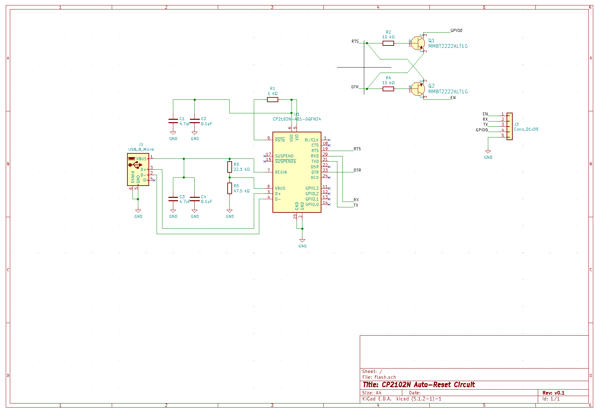
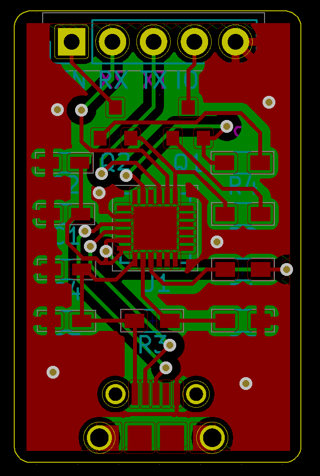
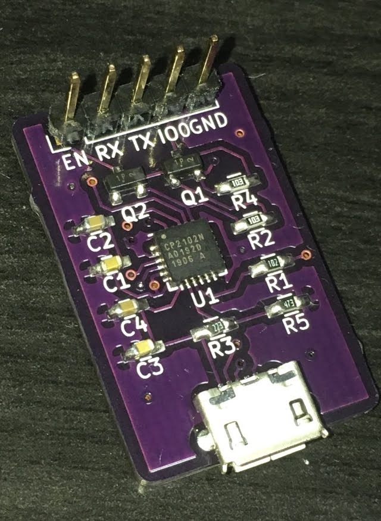

# esp32-autoflasher

KiCad PCB based on the CP2102N USB-UART serial converter. Connect `EN`, `RX`, `TX`, `IO0`, and `GND` to their respective pins on the ESP32 (don't forget to swap the `RX` and `TX` pins!)

## Required Parts

(All resistors and capacitors are size 1608 metric)

| Label | Description |
| --- | --- |
| U1 | CP2102N |
| R1 | 1 kOhm |
| R2 | 10 kOhm |
| R3 | 22.1 kOhm |
| R4 | 10 kOhm |
| R5 | 47.5 kOhm |
| C1 | 4.7 uF |
| C2 | 0.1 uF |
| C3 | 4.7 uF |
| C4 | 0.1 uF |
| Q1 | MMBT2222L transistor (SOT-23 package) |
| Q2 | MMBT2222L transistor (SOT-23 package) |

## Images

### Schematic

### PCB Layout

### Assembled

